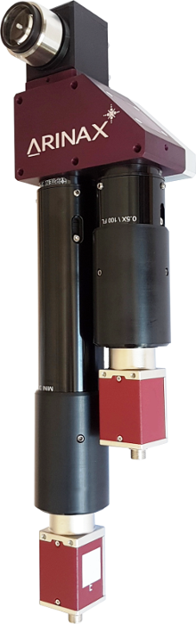

.. _camera-arinax:

Arinax
---------



Introduction
````````````

The OAV B-ZOOM is an On-Axis Video-microscope with a hybrid zoom system used for parallax free observation of micrometer sized crystals.
It is optimized for MX crystallography beamlines and high throughput stations in Synchrotrons.

The OAV B-ZOOM is the next evolution of the OAV Ultra-Zoom: it combines the EMBL patented Objective Head of the OAV with a new zooming and visualization module, allowing instant zoom change and integrating a multi-camera video server.

Installation & Module configuration
````````````````````````````````````

Follow the generic instructions in :ref:`build_installation`. If using CMake directly, add the following flag:

.. code-block:: sh

 -DLIMACAMERA_ARINAX=true

For the Tango server installation, refers to :ref:`tango_installation`.

Initialisation and Capabilities
````````````````````````````````
Implementing a new plugin for new detector is driven by the LIMA framework but the developer has some freedoms to choose which standard and specific features will be made available. This section is supposed to give you good knowledge regarding camera features within the LIMA framework.

Camera initialisation
.....................

The camera will be initialized by creating a :cpp::class:`Arinax::Camera` object. The contructor sets the camera with default parameters, only the ip address or hostname of the camera is mandatory.

Std capabilities
................

This plugin has been implemented in respect of the mandatory capabilites but with some limitations which are due to the camera and SDK features. Only restriction on capabilites are documented here.

* HwDetInfo

  getCurrImageType/getDefImageType(): it can change if the video mode change (see HwVideo capability).

  setCurrImageType(): It only supports Bpp8.

* HwSync

  get/setTrigMode(): the only supported mode are IntTrig.

Optional capabilities
.....................

In addition to the standard capabilities, we make the choice to implement some optional capabilities which
are supported by the SDK. Video and Binning are available.

* HwVideo

  The arinax bzoom is a pure video devicexs, video formats for image are supported:
   - RGB24
   - BGR24

  Use get/setMode() methods of the cpp::class::`Video` object (i.e. CtControl::video()) to read or set the format.

* HwBin

  There is no restriction for the binning up to the maximum size.

Configuration
``````````````

For the hardware and network installation refer to the Arinax documentation.

How to use
````````````
This is a python code example for a simple test:

.. code-block:: python

  from Lima import Arinax
  from lima import Core

  cam = Arinax.Camera("bzoom")

  hwint = Arinax.Interface(cam)
  ct = Core.CtControl(hwint)

  acq = ct.acquisition()

  # set video  and test video

  video=ct.video()
  video.setMode(Core.RGB24)
  video.startLive()
  video.stopLive()
  video_img = video.getLastImage()

  # set and test acquisition

  # setting new file parameters and autosaving mode
  saving=ct.saving()

  pars=saving.getParameters()
  pars.directory='/buffer/lcb18012/opisg/test_lima'
  pars.prefix='test1_'
  pars.suffix='.edf'
  pars.fileFormat=Core.CtSaving.TIFF
  pars.savingMode=Core.CtSaving.AutoFrame
  saving.setParameters(pars)

  acq.setAcqExpoTime(0.1)
  acq.setNbImages(10)
  ct.prepareAcq()
  ct.startAcq()

  # wait for last image (#9) ready
  lastimg = ct.getStatus().ImageCounters.LastImageReady
  while lastimg !=9:
    time.sleep(0.01)
    lastimg = ct.getStatus().ImageCounters.LastImageReady

  # read the first image
  im0 = ct.ReadImage(0)
